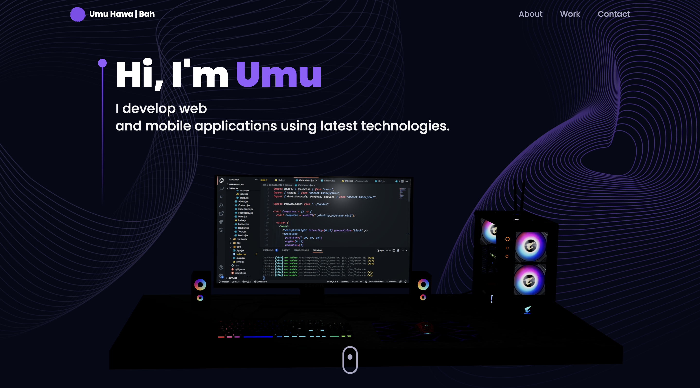

# Personal Portfolio - Showcasing My Journey, Elevating My Presence!

Welcome to my Portfolio – where innovation meets creativity. Dive into captivating projects built with React, Vite, and Three.js, pushing the boundaries of web development.

## Features

**Project Showcase**: I love showcasing projects I've crafted with React, Vite, and Three.js. Each project comes with detailed descriptions and handy links to either try them out or dive into the source code.

**Interactive Design**: I'm all about creating interfaces that captivate and engage. Navigating through my portfolio should feel like a smooth journey, with every click leading to a new discovery. 

**Performance Optimization**: I've fine-tuned my portfolio for lightning-fast loading times and buttery-smooth performance. Your browsing experience should be seamless and uninterrupted.

**Responsive Layout**: No matter what device you're using, my portfolio adapts flawlessly. From desktops to smartphones, you'll find exploring my work just as enjoyable and intuitive.

 

## Project Setup

To set up the project locally, follow these steps:

- Clone the repository: https://github.com/bahumuhawa/WeightTracker.git
- Navigate to the project directory: `cd project-directory`
- Install dependencies: `npm install`
- Start the development server: `npm run dev`

# React + Vite

This template provides a minimal setup to get React working in Vite with HMR and some ESLint rules.

Currently, two official plugins are available:

- [@vitejs/plugin-react](https://github.com/vitejs/vite-plugin-react/blob/main/packages/plugin-react/README.md) uses [Babel](https://babeljs.io/) for Fast Refresh
- [@vitejs/plugin-react-swc](https://github.com/vitejs/vite-plugin-react-swc) uses [SWC](https://swc.rs/) for Fast Refresh
